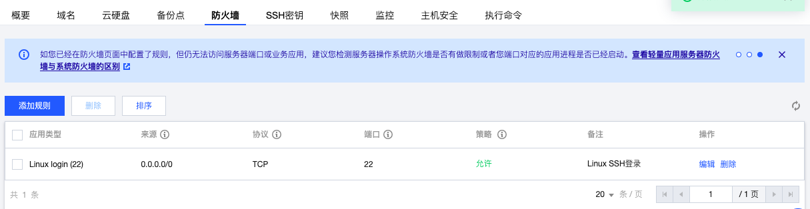
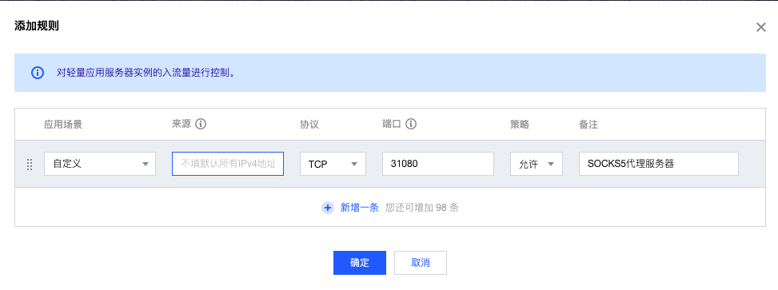

#### 购买&配置云服务器

参考这篇文章[腾讯云服务器开箱配置](https://github.com/AntiBargu/Miscellaneous/blob/master/%E7%8E%AF%E5%A2%83%E9%85%8D%E7%BD%AE/%E8%85%BE%E8%AE%AF%E4%BA%91%E6%9C%8D%E5%8A%A1%E5%99%A8%E5%BC%80%E7%AE%B1%E9%85%8D%E7%BD%AE/%E8%85%BE%E8%AE%AF%E4%BA%91%E6%9C%8D%E5%8A%A1%E5%99%A8%E5%BC%80%E7%AE%B1%E9%85%8D%E7%BD%AE.md)。


#### 启动SOCKS5代理服务器

```shell
podman run -d -p ${SERVICE_PORT}:31080 --name socks5_proxy --restart=always rucetc/penetrator:1.0
```


#### 开放SOCKS5服务

打开**控制台**，选择相应的云服务器，查看**防火墙**配置



假定我们SERVICE_PORT设置为31080，添加防火墙规则：



为了安全起见，建议对访问来源做出限制。我们可以访问[ip138](https://ip138.com/)查询本地IP地址。由于ISP动态分配本地IP地址，故可以在来源指定一个包含本地IP地址的子网。