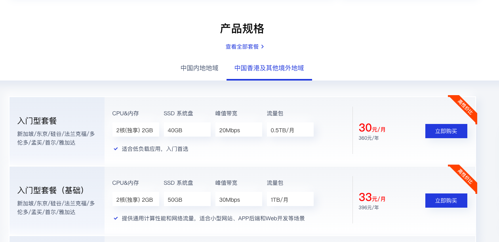
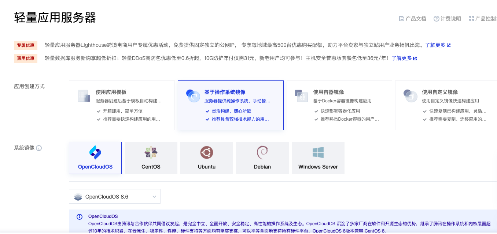
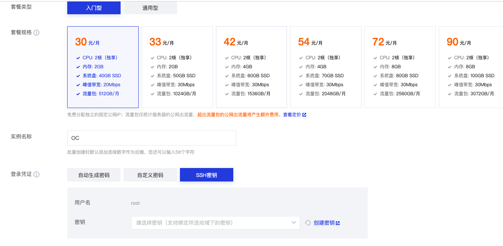
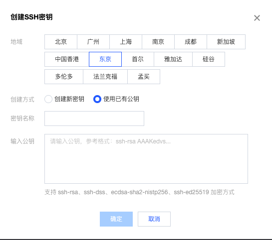
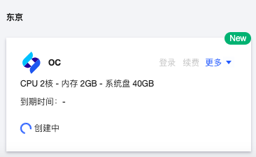

#### 选购云服务器产品



这里我选择**入门型套餐**，并点击**立即购买**。


#### 安装系统镜像

在购买界面可以预装操作系统镜像。



操作系统的话，这里推荐使用OpenCloudOS8.6。


#### 初始化实例配置



初始化实例名称；配置SSH密钥用于免密登录。


#### 创建密钥



选择服务器所在地区**使用已有公钥**。

SSH密钥对生成的方法请参考[公钥加密系统与SSH密钥对生成](https://github.com/AntiBargu/Miscellaneous/blob/master/%E7%8E%AF%E5%A2%83%E9%85%8D%E7%BD%AE/%E5%85%AC%E9%92%A5%E5%8A%A0%E5%AF%86%E7%B3%BB%E7%BB%9F%E4%B8%8ESSH%E5%AF%86%E9%92%A5%E5%AF%B9%E7%94%9F%E6%88%90/%E5%85%AC%E9%92%A5%E5%8A%A0%E5%AF%86%E7%B3%BB%E7%BB%9F%E4%B8%8ESSH%E5%AF%86%E9%92%A5%E5%AF%B9%E7%94%9F%E6%88%90.md)。复制公钥粘贴即可。


#### 进入控制台查看实例



我们可以进入控制台查看实例。


#### 使用ssh登录远端云服务器

```shell
ssh root@${SERVER_NAME}/${SERVER_IP}
```


#### 修改云服务器sshd配置

需要修改链接保活以及超时时长，找到下面的注释配置项：

```shell
sed -i 's/^.*ClientAliveInterval.*$/ClientAliveInterval 127/' /etc/ssh/sshd_config
sed -i 's/^.*ClientAliveCountMax.*$/ClientAliveCountMax 65535/' /etc/ssh/sshd_config
```

重启sshd服务使上述配置项生效

```shell
service sshd restart
```


#### 配置podman

OpenCloud OS默认使用的容器运行时是podman。

##### 安装podman

```shell
yum install podman -y
```

##### 将podman设置为开机启动

```shell
systemctl enable podman
```

